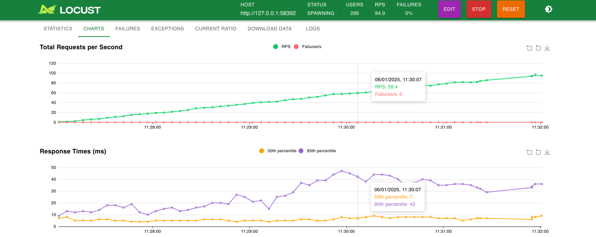
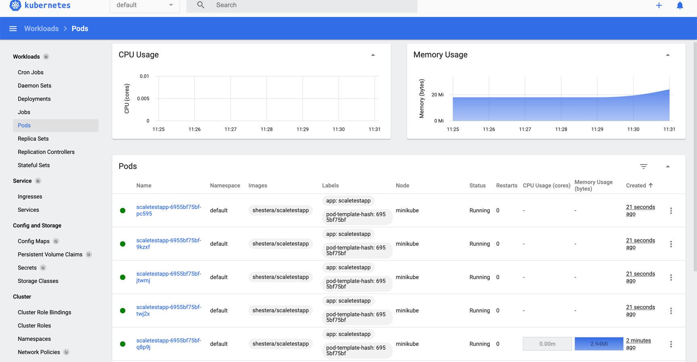
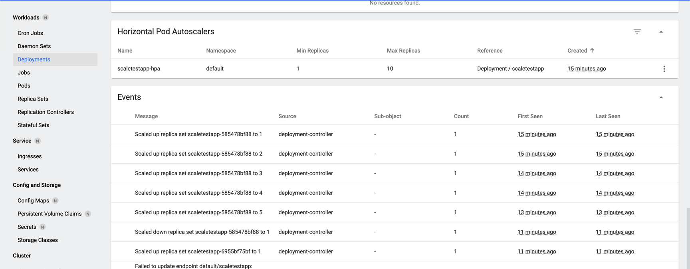

# Задание 2. Динамическое масштабирование контейнеров


- Start minikube:
```shell
minikube start --memory=2048 --cpus=2 
minikube addons enable metrics-server 
```

- Загрузить образ в minikube:
```shell
eval $(minikube docker-env)
docker pull shestera/scaletestapp
```

- Деплой сервиса:
```shell
cd Exc2
kubectl apply -f scaletestapp-deployment.yaml
kubectl apply -f scaletestapp-service.yaml
kubectl apply -f hpa-rbac.yaml
kubectl apply -f hpa.yaml
```

- Проверить сервис по HTTP:
```shell
minikube service scaletestapp --url
```
- Пример:
  - http://127.0.0.1:64939
  - http://127.0.0.1:64939/metrics

- Запустить Dashboard
```shell
minikube dashboard
```

- Запустить Locust для нагрузки:
```shell
python3 -m venv venv
source venv/bin/activate
pip install locust
locust 
```
- Запустить 1 - 1000 Users 

- Увеличение реплик при росте расхода памяти:
стоит averageUtilization `70%` от `20Mi`
- с какого то момента начинают плодиться реплики
Немного неочевидно для меня тк начинают плодиться раньше вроде бы чем лимиты достигнуты
При этом тестовое приложение видимо не возвращает память потому обратно реплики не убиваются уже





